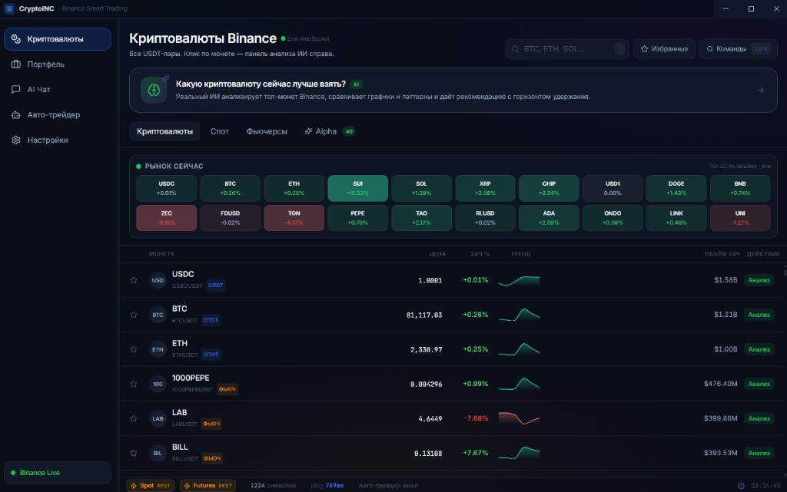
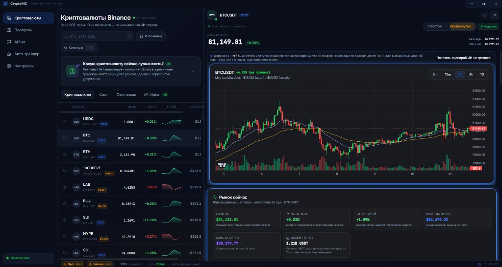
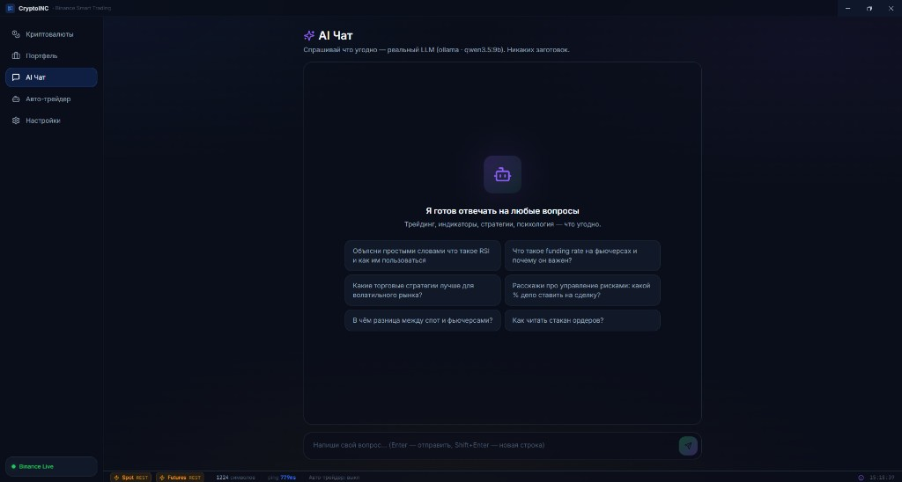
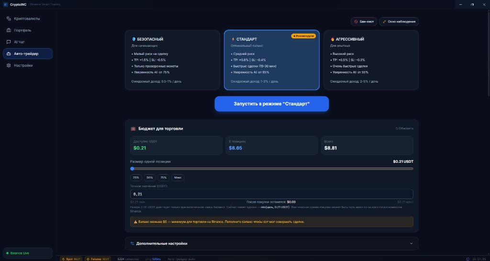
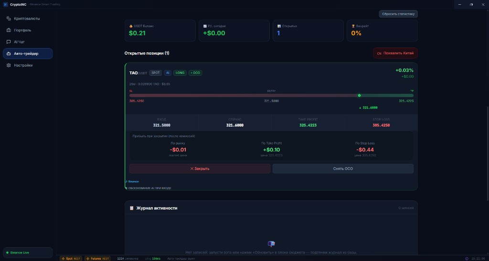

<div align="center">

# CryptoINC

**Умная десктоп‑платформа для торговли и анализа криптовалют на Binance**

**Локальный AI (Ollama) · Глубокая аналитика · Авто‑трейдер (по подписке/ключу) · 100% русский интерфейс**

[](https://github.com/KnoIcen/CryptoINC-Releases/releases/latest)
[](./SETUP_GUIDE.md)
[](#-поддержать-автора)

</div>

> ⚠️ **Disclaimer.** Проект образовательный. Никаких гарантий прибыли. Торговля криптовалютами связана с риском полной потери средств. Не является финансовой рекомендацией.

---

## ⬇️ Скачать (Windows)

Скачивание происходит **только через GitHub Releases** (без исходников).

- Открой: `https://github.com/KnoIcen/CryptoINC-Releases/releases/latest`  
- Скачай: `CryptoINC.Setup.*.exe`  
- Запусти установку

### Если Windows ругается на установщик

Для новых приложений без code‑sign сертификата Windows может показать предупреждение:

- Нажми **Подробнее** → **Выполнить в любом случае**

---

## ✨ Что умеет (коротко)

- **Binance Live**: список монет, цены, базовые метрики
- **Аналитика**: график, ключевые уровни, метрики, объяснения
- **AI‑помощник**: чат по трейдингу (опционально, зависит от настроек)
- **Авто‑трейдер**: режимы риск‑профиля (планируется как платная функция по ключу/подписке)

---

## 🖼️ Скриншоты

**CryptoINC — это десктоп‑интерфейс, который показывает рынок, графики, аналитику и панель автотрейдинга.**

**1) Рынок и список монет (Binance Live):**



**2) Анализ выбранной монеты (график + ключевые метрики):**



**3) AI Chat (встроенный помощник по трейдингу):**



**4) Авто‑трейдер (режимы: безопасный / стандарт / агрессивный):**



**5) Позиция и управление (TP/SL/OCO, P/L, журнал активности):**



---

## 📘 Инструкция по настройке (детально)

Открой файл **[`SETUP_GUIDE.md`](./SETUP_GUIDE.md)** — там пошагово, “как для новичка”.

---

## 💻 Системные требования

- **Windows**: 10/11 (x64)
- **Интернет**: нужен (Binance/цены/новости)
- **Для локального AI (опционально)**:
  - установленная **Ollama**
  - желательно видеокарта с **8 GB VRAM+** (но зависит от модели)

---

## ❓ FAQ (частые вопросы)

**Windows пишет “неизвестный издатель”. Это вирус?**  
Нет, это типично для приложений без платного code‑sign сертификата. Скачивай установщик только из `Releases/latest`.

**Где скачать самую свежую версию?**  
Всегда здесь: `https://github.com/KnoIcen/CryptoINC-Releases/releases/latest`

**Зачем нужны ключи Binance API?**  
Чтобы приложение могло читать баланс/позиции и (если ты разрешишь) выставлять ордера.  
**Никогда не включай Withdrawals** для API‑ключа.

**Можно ли пользоваться без AI?**  
Да. AI‑часть опциональна (зависит от сборки и настроек).

---

## 🧾 Changelog

- **v1.0.0** — первый публичный релиз установщика для Windows.

---

## 🔑 Политика ключей / подписки (план)

Функция **“Авто‑трейдинг”** планируется как платная (по ключу активации / подписке).  
Публичный репозиторий **не содержит исходников** и служит только для скачивания установщика и документации.

---

## ❤️ Поддержать автора

Если тебе нравится проект и хочешь поддержать разработку, можно отправить донат в **USDT (TRC20)**:

```
TG9925b89bADiwr3YmtFbcL67MdbaXwAWk
```

